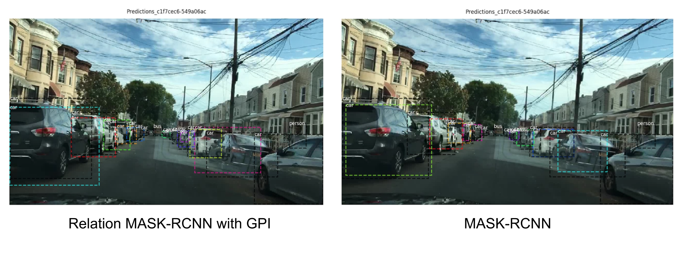

# RelationMaskRCNN
This is an implementation of a Relation [Mask R-CNN](https://arxiv.org/abs/1703.06870/) based on [3]. In this repository, we use a version of a special Graph Networks implemented inside Mask-RCNN[2], which called GPI (Graph Permutation Invariant [1]), that use the structure of graphs for a detection task on [Berkeley Deep Drive](http://bdd-data.berkeley.edu/) dataset.

## Introduction

## Qualitative Examples

## References
[1] Roei Herzig, Moshiko Raboh, Gal Chechik, Jonathan Berant, Amir Globerson, [Mapping Images to Scene Graphs with Permutation-Invariant Structured Prediction](https://arxiv.org/abs/1802.05451), NIPS, 2018.

[2] Kaiming He, Georgia Gkioxari, Piotr Dollár, Ross Girshick, [Mask R-CNN](https://arxiv.org/abs/1703.06870/), ICCV, 2017.

[3] Abdulla Waleed, [Mask R-CNN for object detection and instance segmentation on Keras and TensorFlow](https://github.com/matterport/Mask_RCNN), 2017,
